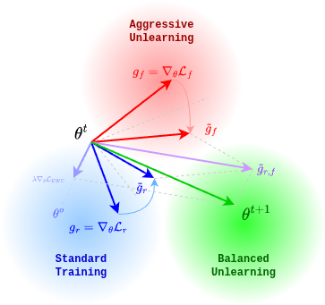
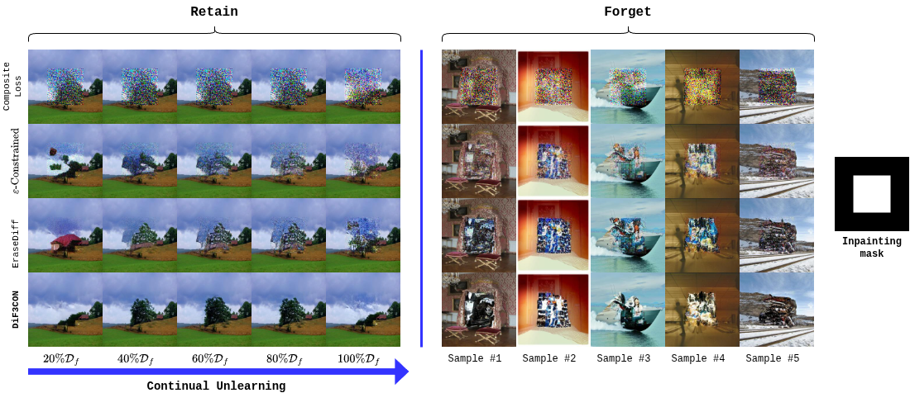
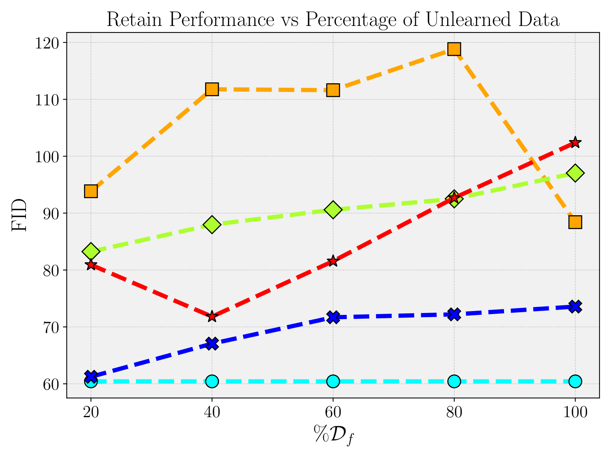
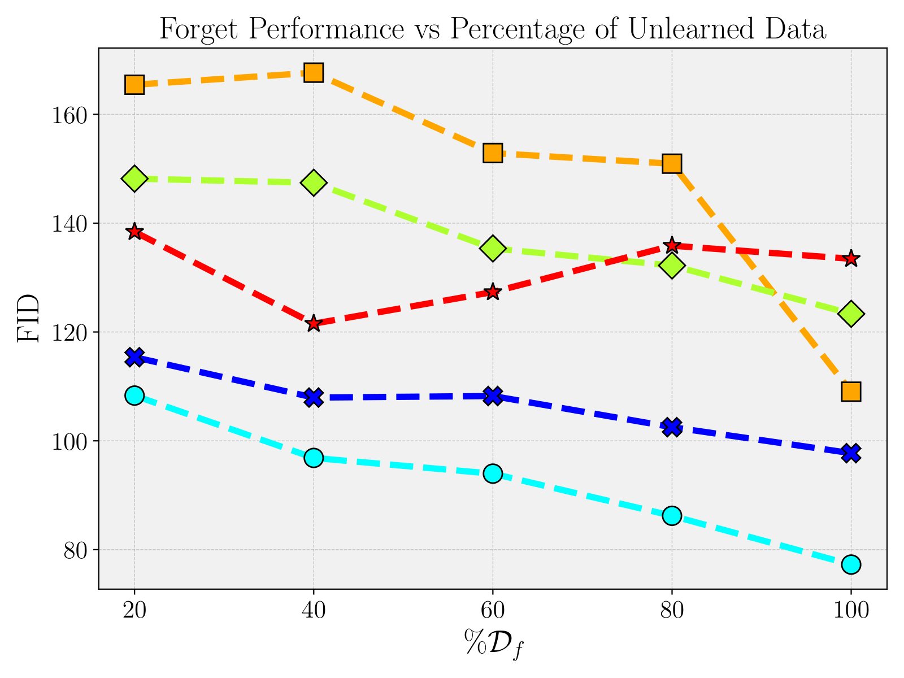

# DiF3CON: Diffusion Forgetting via Continual Unlearning

Official PyTorch implementation of the paper "DiF3CON: Diffusion Forgetting via Continual Unlearning".

Diffusion models have emerged as the dominant framework for image generation, offering high fidelity samples and flexible conditioning. However, they may pose risks with regard to generating copyright-sensitive or inappropriate content that may be exploited by malicious actors. Machine unlearning emerged as a counteraction to this phenomenon, seeking to efficiently remove the influence of specific training data without sacrificing the general performance. Prior work on diffusion unlearning mostly targets text-to-image or class-conditional models, while image-to-image settings such as inpainting remain largely unexplored. In this work, we introduce DiF3CON (*DiFFusion Forgetting via CONtinual unlearning*), a continual unlearning framework for diffusion-based inpainting models. Inspired by regularization and stability mechanisms from multi-task learning, DiF3CON simulates iterative, efficient class-wise data removal, without compromising the performance of the base diffusion model. Extensive experiments on the Places365 dataset show that DiF3CON achieves unlearning stability over significantly larger forgetting data volumes, advancing this relatively underexplored area of machine unlearning for diffusion-based image-to-image models.

The repository contains the continual unlearning pipeline used for the main DiF3CON experiments, baseline configurations for comparison and evaluation code for FID and IS.




## Repository overview

- `unlearn_curriculum.py`: continual unlearning entry point used for the main DiF3CON experiments
- `unlearn.py`: non-curriculum unlearning entry point
- `train_diffusion.py`: base diffusion model training and testing
- `configs/`: YAML configs for DiF3CON and baseline methods
- `metrics/`: FID, IS, and CLIP utilities
- `figures/`: figures and source assets from the paper

## Installation

Create a virtual environment and install the Python dependencies:

```bash
conda create -n dif3con python=3.11
conda activate dif3con
pip install --upgrade pip
pip install -r requirements.txt
```

Notes:

- A CUDA-enabled PyTorch setup is strongly recommended for training and evaluation.
- If you need a specific CUDA build of PyTorch, install the matching `torch` and `torchvision` wheels first, then install the remaining requirements.

## Data and checkpoint setup

Before running any experiment, update the paths inside the YAML config you plan to use:

- `paths.train_data`: Places365 training root
- `paths.test_data`: Places365 validation/test root
- `paths.teacher_checkpoint`: pretrained base inpainting model
- `paths.experiment_name`: output folder name under `experiments/`
- `paths.resume_state`: checkpoint label to resume from or evaluate
- `paths.img_save_dir`: optional subfolder name for saved test images

The provided configs contain specific paths and a Discord webhook field. Replace those values for your environment, or set `discord_webhook.url` to `null` if you do not want notifications.

For a fresh training run, set `paths.resume_state` to `null` or `""`. Only set it to a checkpoint label when resuming training or running evaluation.

### Expected dataset layout

The code expects class folders under the dataset root, for example:

```text
places365/
├── train_256/
│   ├── abbey/
│   ├── airport_terminal/
│   └── ...
└── val_256/
    ├── abbey/
    ├── airport_terminal/
    └── ...
```

For Places365, the default forget/retain split is defined in [`configs/forget_retain_splits.yml`](configs/forget_retain_splits.yml). Class names are read from [`configs/places365_classes.txt`](configs/places365_classes.txt).

All unlearning runs assume that `paths.teacher_checkpoint` points to a pretrained teacher model. If you need to train a base model first, use `train_diffusion.py` with a compatible config. The pretrained Places365 inpainting teacher checkpoint used in our experiments can be found [here](https://ctipub-my.sharepoint.com/:u:/g/personal/catalin_ciocirlan_stud_etti_upb_ro/IQDVrHW79deeR7uJAr58G3aAAa4jyn2lGKwLjlu8EBcmBQ8?e=gfA2hV).

## Running unlearning

### Continual unlearning

The main paper setting uses `unlearn_curriculum.py`. The closest provided config to the full DiF3CON setup is:

```bash
python unlearn_curriculum.py configs/places365_unlearning_grad_harm_curriculum.yml --phase train
```

Useful config fields for continual runs:

- `curriculum.forget_classes_to_unlearn_step`: how many new forget classes are added per step
- `curriculum.curriculum_steps`: number of curriculum iterations
- `curriculum.sample_retain`: retain buffer fraction
- `curriculum.buffer_forget`: replay fraction for previously forgotten classes
- `unlearn.regularization` and `unlearn.regularization_params`: regularization used to stabilize continual forgetting

The paper's main qualitative continual-unlearning comparison is shown below. As the forget set grows, DiF3CON better preserves retain-set reconstructions while producing stronger degradation on the forget set.




During training, checkpoints are saved under:

```text
experiments/<experiment_name>/checkpoint/
```

For curriculum runs, the code also saves labeled checkpoints such as:

- `<N>_forget_classes_Diffuser.pth`
- `<N>_forget_classes.state`

where `<N>` is the number of forget classes included up to that stage.

### Non-curriculum unlearning

The repository also provides `unlearn.py` for single-step unlearning experiments:

```bash
python unlearn.py <config.yml> --phase train
```

In practice, the paper's main results are centered on the continual pipeline above, so that is the recommended starting point.

## Evaluating models

Evaluation is done through the same entry point, using `--phase test`. Make sure the config points to the checkpoint you want to test through `paths.resume_state`.

Example for a curriculum checkpoint:

```bash
python unlearn_curriculum.py configs/places365_unlearning_grad_harm_curriculum.yml --phase test
```

If you want to evaluate the final `25_forget_classes` checkpoint from a curriculum run, set:

```yaml
paths:
  resume_state: "25_forget_classes"
  img_save_dir: "25_forget_classes_center_25"
```

When `test.metrics.fid` and `test.metrics.is` are enabled in the config, the test phase computes:

- `fid_retain`
- `fid_forget`
- `is_gt_retain`
- `is_output_retain`
- `is_gt_forget`
- `is_output_forget`

You can reduce evaluation cost with `test.num_img_per_class`, which is already used in several of the provided configs.

The outputs are written to:

- generated images: `experiments/<experiment_name>/results/test/<img_save_dir>/`
- split images: `.../retain/` and `.../forget/`
- metric summary: `experiments/<experiment_name>/results/test/metrics.json` or `metrics_<img_save_dir>.json`
- logs: `experiments/<experiment_name>/test.log`

The repository also includes standalone metric helpers in `metrics/`, but for the paper workflow the built-in `--phase test` evaluation is the most direct option.

The main multi-class metric trend reported in the paper is the evolution of retain and forget FID as more classes are unlearned:






